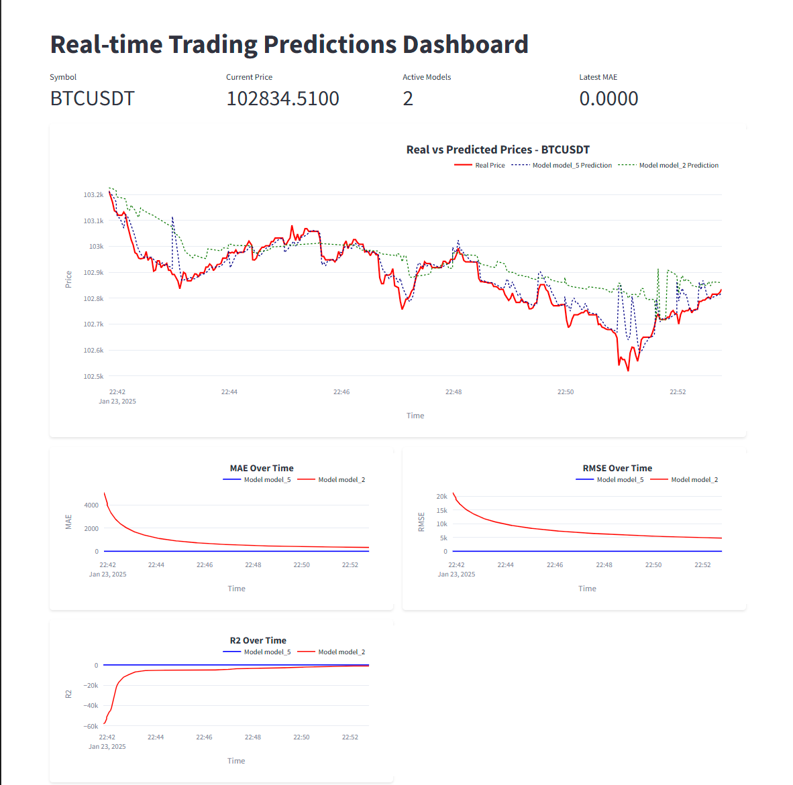

# 📈 Real-Time Cryptocurrency Prediction System


A modern, real-time cryptocurrency price prediction system using Kafka streaming and online machine learning algorithms.


**Author:** Zakaria Akil

---

## ✨ Features

- 🔄 **Real-Time Streaming** - Live cryptocurrency data from Binance WebSocket
- 🤖 **Multiple ML Models** - 5 online learning algorithms running in parallel
- 📊 **Modern Dashboard** - Beautiful dark/light theme with interactive charts
- 📈 **Live Predictions** - Real-time price predictions with performance metrics
- 🎯 **Model Comparison** - Compare MAE, RMSE, R², and MAPE across models
- ⚡ **Kafka Integration** - Scalable streaming architecture
- 🎨 **Enhanced UI** - Modern, responsive design with smooth animations

---

## Project Overview
This project implements Real-Time Cryptocurrency Symbol Prediction Using Kafka and stream learning techniques.

## Prerequisites
- Python 3.8+
- Binance Account and API Keys from Binance (if you want to use Client data retrieval script)
  

## Installation

### Dependencies
```bash
pip install -r requirement.tx
```

### Binance Client API Configuration [Not required for the demo]
1. Create a Binance account
2. Generate API Key and Secret Key
3. Set environment variables:
```bash
export BINANCE_API_KEY='your_api_key'
export BINANCE_SECRET='your_secret_key'
```

## Batch Learning Models
This part is not included in the application workflow, it is implemented in jupyter notebooks and served to do a comparative study between batch and online learning.
### Implemented Models
1. **ARIMAX**
   - Time series forecasting model
   - Incorporates exogenous variables
   - Handles linear trends and seasonality

2. **Support Vector Regression (SVR)**
   - Non-linear regression technique
   - Effective for complex, non-linear relationships
   - Handles high-dimensional data

3. **Prophet**
   - Developed by Facebook
   - Robust to missing data and shifts
   - Automatic trend, seasonality detection

## Streaming Learning Models

### Online Learning Algorithms
1. **PARegressor (Passive-Aggressive Regressor)**
   - Online learning algorithm
   - Updates model incrementally
   - Handles changing data distributions

2. **KNNRegressor (K-Nearest Neighbors)**
   - Non-parametric method
   - Adapts to local data patterns
   - Suitable for streaming data

3. **ARFRegressor (Adaptive Random Forest)**
   - Ensemble method for streaming data
   - Dynamic model updates
   - Handles concept drift

4. **Linear Regression**
   - Gives a baseline model
   - Simple, interpretable model
   - Incremental learning capabilities

6. **Neural Network Regressor**
   - Deep learning approach
   - Captures complex non-linear patterns
   - Adaptable through online learning

## Demo Walkthrough

### Dashboard Features
- Real-time Crypto price predictions
- Model performance visualization
- Comparative analysis of different models

### Screenshot

**Enhanced Dashboard (v2.0)**


**Features:**
- Real-time price tracking with live updates
- Multiple model predictions displayed simultaneously
- Interactive charts with hover details
- Performance metrics visualization (MAE, RMSE, R², MAPE)
- Dark/Light theme support
- Gradient-filled metric charts
- Modern card-based layout

## Running the Project

### Data Retrieval
```bash
python binance_data.py
```

### Kafka Setup
1. Start Kafka server
2. Run topics:
```bash
python SymbolsData_Topic.py
python Results_Topic.py
```

### Data Processing
```bash
python ProduceData.py
python ConsumeTrainProduce.py
```

### Launch Dashboard

**Option 1: Enhanced Dashboard (Recommended)**
```bash
cd kafka_streaming
./run_dashboard.sh
# Or directly:
streamlit run Dashboard_Enhanced.py
```

**Option 2: Original Dashboard**
```bash
cd kafka_streaming
streamlit run Dashboard_Streamlit.py
```

The enhanced dashboard features:
- Modern dark/light theme toggle
- Improved visualizations with gradient fills
- Better metric cards and layouts
- Smooth animations and transitions
- Enhanced color schemes
- Responsive design

## Performance Metrics
- Mean Absolute Error (MAE)
- Root Mean Square Error (RMSE)
- Mean Absolute Pourcentage Error (MAPE)
- R-squared (R²) Score

##  Project Technologies
<p align="center">
  
  
  
  
  
</p>


## Future Improvements
- Implement more advanced streaming models
- Enhanced feature engineering during the online learning
- Tracking price predictions for multiple symbols at a time
- Add model performance comparison table
- Implement alert system for significant price changes
- Add historical data replay feature
- Export predictions and metrics to CSV

---

## 📝 License

MIT License - feel free to use and modify!

---

## 👤 Author

**Zakaria Akil**
- GitHub: [@zakil-02](https://github.com/zakil-02)
- Email: zakaria.akil.2002@gmail.com

---

**Happy Trading! 📈**

